********************************************************
Deploying Cloudera Manager and CDH 5 on EMC Isilon
********************************************************

This document describes how to create a Hadoop environment utilizing
Cloudera Manager and an EMC Isilon Scale-Out NAS for HDFS accessible
shared storage. VMware Big Data Extensions is used to provision and
manage the compute resources.

Introduction
============

IDC published an update to their Digital Universe study in December 2012
and found that the rate of digital data creation is not only continuing
to grow, but the rate is actually accelerating. By the end of this
decade we will create 40 Zettabytes of new digital information yearly or
the equivalent of 1.7MB of digital information for every man, woman, and
child every second of every day.

This information explosion is creating new opportunities for our
businesses to leverage digital information to serve their customers
better, faster, and most cost effectively through Big Data Analytics
applications.  Hadoop technologies can be cost effective solutions and
can manage structured, semi-structured and unstructured data unlike
traditional solutions such as RDBMS. The need to track and analyze
consumer behavior, maintain inventory and space, target marketing offers
on the basis of consumer preferences and attract and retain consumers,
are some of the factors pushing the demand for Big Data Analytics
solutions using Hadoop technologies. According to a new market report
published by Transparency Market Research
(http://www.transparencymarketresearch.com) "Hadoop Market - Global
Industry Analysis, Size, Share, Growth, Trends, and Forecast, 2012-
2018," the global Hadoop market was worth USD 1.5 billion in 2012 and is
expected to reach USD 20.9 billion in 2018, growing at a CAGR of 54.7%
from 2012 to 2018.

Hadoop like any new technology can be time consuming, and expensive for
our customers to get deployed and operational. When we surveyed a number
of our customers, two main challenges were identified to getting
started: confusion over which Hadoop distribution to use and how to
deploy using existing IT assets and knowledge. Hadoop software is
distributed by several vendors including Pivotal, Hortonworks, and
Cloudera with proprietary extensions. In addition to these
distributions, Apache distributes a free open source version. From an
infrastructure perspective many Hadoop deployments start outside the IT
data center and do not leverage the existing IT automation, storage
efficiency, and protection capabilities. Many customers cited the time
it took IT to deploy Hadoop as the primary reason to start with a
deployment outside of IT.

This guide is intended to simplify Hadoop deployments by creating a
shared storage model with EMC Isilon scale out NAS and using the
industry leader in Enterprise Hadoop, Cloudera, reduce the time to
deployment, and the cost of deployment leveraging Cloudera Manager
tool’s that can automate Hadoop cluster deployments.

Audience
--------

This document is intended for IT program managers, IT architects,
Developers, and IT management to easily deploy Cloudera Hadoop with
automation tools and leverage EMC Isilon for HDFS shared storage. It can
be used by somebody who does not yet have an EMC Isilon cluster by
downloading the free EMC Isilon OneFS Simulator which can be installed
as a virtual machine for testing and training. However, this document
can also be used by somebody who will be installing in a production
environment as best-practices are followed whenever possible.

Apache Hadoop Projects
----------------------

Apache Hadoop is an open source, batch data processing system for
enormous amounts of data.  Hadoop runs as a platform that provides
cost-effective, scalable infrastructure for building Big Data analytic
applications. All Hadoop clusters contain a distributed file system
called the Hadoop Distributed File System (HDFS), a computation layer
called MapReduce.

The Apache Hadoop project contains the following subprojects:

- **Hadoop Distributed File System (HDFS)** – A distributed
  file system that provides high-throughput access to application data.

- **Hadoop MapReduce** – A software framework for writing
  applications to reliably process large amounts of data in parallel
  across a cluster.

Hadoop is supplemented by an ecosystem of Apache projects, such as Pig,
Hive, Sqoop, Flume, Oozie, Whirr, HBase, and Zookeeper that extend the
value of Hadoop and improves its usability.

Version 2 of Apache Hadoop introduces YARN, a sub-project of Hadoop that
separates the resource management and processing components. YARN was
born of a need to enable a broader array of interaction patterns for
data stored in HDFS beyond MapReduce. The YARN-based architecture of
Hadoop 2.0 provides a more general processing platform that is not
constrained to MapReduce.

For full details of the Apache Hadoop project see http://hadoop.apache.org/.

Cloudera CDH and Cloudera Manager
---------------------------------

CDH (Cloudera’s Distribution Including Apache Hadoop) is the world’s
most complete, tested, and widely deployed distribution of Apache
Hadoop. CDH is 100% open source and is the only Hadoop solution to
offer batch processing, interactive SQL, and interactive search as well
as enterprise-grade continuous availability. More enterprises have
downloaded CDH than all other distributions combined.

CDH delivers the core elements of Hadoop – scalable storage and
distributed computing – as well as all of the necessary enterprise
capabilities such as security, high availability and integration with a
broad range of hardware and software solutions

Cloudera Manager is the industry’s first and most sophisticated
management application for Apache Hadoop. Cloudera Manager sets the
standard for enterprise deployment by delivering granular visibility
into and control over every part of the Hadoop cluster — empowering
operators to improve performance, enhance quality of service, increase
compliance and reduce administrative costs.

Cloudera Manager is designed to make administration of Hadoop simple and
straightforward, at any scale. With Cloudera Manager, you can easily
deploy and centrally operate the complete Hadoop stack. The application
automates the installation process, reducing deployment time from weeks
to minutes; gives you a cluster-wide, real-time view of nodes and
services running; provides a single, central console to enact
configuration changes across your cluster; and incorporates a full range
of reporting and diagnostic tools to help you optimize performance and
utilization.

More information on Cloudera can be found on http://www.cloudera.com/.

Isilon Scale-Out NAS For HDFS
-----------------------------

EMC Isilon is the only scale-out NAS platform natively integrated with
the Hadoop Distributed File System (HDFS). Using HDFS as an
over-the-wire protocol, you can deploy a powerful, efficient, and
flexible data storage and analytics ecosystem.

In addition to native integration with HDFS, EMC Isilon storage easily
scales to support massively large Hadoop analytics projects. Isilon
scale-out NAS also offers unmatched simplicity, efficiency, flexibility,
and reliability that you need to maximize the value of your Hadoop data
storage and analytics workflow investment.

Overview of Isilon Scale-Out NAS for Big Data
---------------------------------------------

The EMC Isilon scale-out platform combines modular hardware with unified
software to provide the storage foundation for data analysis. Isilon
scale-out NAS is a fully distributed system that consists of nodes of
modular hardware arranged in a cluster. The distributed Isilon OneFS
operating system combines the memory, I/O, CPUs, and disks of the nodes
into a cohesive storage unit to present a global namespace as a single
file system.

The nodes work together as peers in a shared-nothing hardware
architecture with no single point of failure. Every node adds capacity,
performance, and resiliency to the cluster, and each node acts as a
Hadoop namenode and datanode. The namenode daemon is a distributed
process that runs on all the nodes in the cluster. A compute client can
connect to any node through HDFS.

As nodes are added, the file system expands dynamically and
redistributes data, eliminating the work of partitioning disks and
creating volumes. The result is a highly efficient and resilient storage
architecture that brings all the advantages of an enterprise scale-out
NAS system to storing data for analysis.

Unlike traditional storage, Hadoop's ratio of CPU, RAM, and disk space
depends on the workload—factors that make it difficult to size a Hadoop
cluster before you have had a chance to measure your MapReduce workload.
Expanding data sets also makes sizing decisions upfront problematic.
Isilon scale-out NAS lends itself perfectly to this scenario: Isilon
scale-out NAS lets you increase CPUs, RAM, and disk space by adding
nodes to dynamically match storage capacity and performance with the
demands of a dynamic Hadoop workload.

An Isilon cluster optimizes data protection. OneFS more efficiently and
reliably protects data than HDFS. The HDFS protocol, by default,
replicates a block of data three times. In contrast, OneFS stripes the
data across the cluster and protects the data with forward error
correction codes, which consume less space than replication with better
protection.

Cloudera and EMC Joint Support Statement
----------------------------------------

EMC Isilon and Cloudera are pleased to communicate a business
collaboration and intention to enable joint support for EMC Isilon
scale-out NAS and Cloudera Enterprise products to bring the value of
Cloudera Enterprise to customers using EMC Isilon storage.

EMC Isilon Scale-Out NAS storage for Hadoop currently supports the
Apache Hadoop Distributed File System (HDFS) protocol. CDH is 100% open
source and is the only Hadoop solution to offer batch processing,
interactive SQL and interactive search, as well as enterprise-grade
continuous availability.

EMC Isilon allows a customer to start using Hadoop now by using already
existing data thus eliminating extra copies and reducing associated
CAPEX costs for additional storage capacity. In addition, EMC Isilon is
the only Hadoop storage solution that allows you access to the data via
NAS (i.e. SMB) or HDFS protocols as well as providing a  POSIX-Compliant
file system for regulated environments.

EMC Isilon and Cloudera are now jointly working to support the following
two scenarios:

- Customers running Cloudera Enterprise on EMC Isilon NAS
  products.

  - Customers will be able to leverage the full Cloudera Enterprise offering
    on their existing data sets stored in EMC Isilon. Cloudera Enterprise is
    a subscription offering that combines CDH with Cloudera Manager for
    system management, Cloudera Navigator for data management, technical
    support, indemnity, and open source advocacy. Customers will be able to
    simplify storage management and reduce overall costs by managing storage
    and compute independently, with new server hardware purchases required
    only for additional compute in the case of an existing EMC Isilon
    installation.

- Customers wishing to integrate existing Cloudera Enterprise
  and EMC Isilon clusters.

  - Customers will be able to integrate existing EMC Isilon clusters with
    existing HDFS-storage based Cloudera Enterprise clusters by using
    existing Hadoop tools built for data movement. This scenario will allow
    customers to more easily ingest data into both systems, as well as
    enable use cases such as online or remote backup and disaster recovery.

EMC Isilon and Cloudera are currently working on product development and
support models, and intend to have a supported joint offering in the
market in the first half of 2014.

In addition, EMC Isilon and Cloudera are working together to advance the
ongoing joint roadmap for Cloudera Enterprise on EMC Isilon Scale-Out
NAS for subsequent releases of CDH, Cloudera manager, Cloudera Navigator
and OneFS software.

This guide illustrates the first scenario. Using an existing Isilon
cluster to integrate with Cloudera manager to allow CDH access to
existing data sets located in the Isilon cluster.

Environment
===========

Versions
--------

The test environments used for this document consist of the following
software versions:

* Cloudera Manager 5.1.0
* Cloudera CDH 4.7, 5.0.3, and 5.1.0
* Isilon OneFS 7.1.1 and 7.1.1 with patch-130611
* VMware vSphere Enterprise 5.5.0
* VMware Big Data Extensions 2.0

.. table:: Cloudera CDH and Isilon OneFS Compatibility Matrix

  +--------------------+---------------------+----------------+-------------------------------+
  |                    | OneFS Version                                                        |
  +--------------------+---------------------+----------------+-------------------------------+
  | CDH Version        | 7.0.2.2 - 7.1.0.0   | 7.1.1.0        | 7.1.1.0 + patch-130611        |
  +====================+=====================+================+===============================+
  | 4.2 - 4.7\ :sup:`3`| compatible\ :sup:`1`| compatible     | compatible                    |
  +--------------------+---------------------+----------------+-------------------------------+
  | 5.0.3              | not compatible      | not compatible | compatible                    |
  +--------------------+---------------------+----------------+-------------------------------+
  | 5.1.0              | not compatible      | not compatible | partially compatible\ :sup:`2`|
  +--------------------+---------------------+----------------+-------------------------------+

:sup:`1` Fully-compatible but commands and features described in this
document may not all apply to this version of OneFS.

:sup:`2` Impala 1.4 on CDH 5.1.0 is not compatible with OneFS.

:sup:`3` Commands and features described in this document may not all
apply to these versions of CDH.
 

Hosts
-----

A typical Hadoop environment composed of many types of hosts. Below is a
description of these hosts.

|image0|

List of Hosts in Hadoop Environments

+-----------------------------+--------------------------------------------------------------+
| Host (Host Name)            | Description                                                  |
+=============================+==============================================================+
| DNS/DHCP Server             | It is recommended to have a DNS and DHCP server that you can |
|                             | control. This will be used by all other hosts for DNS and    |
|                             | DHCP services.                                               |
+-----------------------------+--------------------------------------------------------------+
| VMware vCenter              | VMware vCenter will manage all ESXi hosts and their VMs. It  |
|                             | is required for Big Data Extensions (BDE).                   |
+-----------------------------+--------------------------------------------------------------+
| VMware Big Data Extensions  | This will run the Serengeti components to assist in          |
| vApp Server (bde)           | deploying Hadoop clusters.                                   |
+-----------------------------+--------------------------------------------------------------+
| VMware ESXi                 | Physical machines will run the VMware ESXi operating system  |
|                             | to allow virtual machines to run in them.                    |
+-----------------------------+--------------------------------------------------------------+
| Linux workstation           | You should have a Linux workstation with a GUI that you can  |
| (workstation)               | use to control everything with.                              |
+-----------------------------+--------------------------------------------------------------+
| Isilon nodes                | You will need one or more Isilon Scale-Out NAS nodes. For    |
| (isiloncluster1-1, 2, 3,    | functional testing, you can use a single Isilon OneFS        |
| ...)                        | Simulator node instead of the Isilon appliance. The nodes    |
|                             | will be clustered together into an *Isilon Cluster*. Isilon  |
|                             | nodes run the OneFS operating system.                        |
+-----------------------------+--------------------------------------------------------------+
| Isilon InsightIQ            | This is optional licensed software from Isilon and can be    |
|                             | used to monitor the health and performance of your Isilon    |
|                             | cluster. It is recommend for any performance testing.        |
+-----------------------------+--------------------------------------------------------------+
| Cloudera Manager            | A dedicated host will run the Cloudera Manager application   |
| (c5manager-server-0)        | and the Cloudera Management Services. This will deploy and   |
|                             | monitor the Cloudera CDH Hadoop components.                  |
+-----------------------------+--------------------------------------------------------------+
| Cloudera CDH Hadoop Master  | This host will the YARN Resource Manager, Job History        |
| (mycluster1-master-0)       | Server, Hue Server, Hive Metastore Server, etc. In general,  |
|                             | it will run all "master" services except for the HDFS Name   |
|                             | Node.                                                        |
+-----------------------------+--------------------------------------------------------------+
| Cloudera CDH Hadoop Name    | This host will only run the CDH Name Node. This will only be |
| Node                        | used during the installation process. Once you reconfigure   |
| (mycluster1-namenode-0)     | the CDH components to use Isilon for HDFS, this node will be |
|                             | idle.                                                        |
+-----------------------------+--------------------------------------------------------------+
| Cloudera CDH Hadoop Worker  | There will be any number of worker nodes, depending on the   |
| Node (mycluster1-worker-0,  | compute requirements. Each node will run the YARN Node       |
| 1, 2, ...)                  | Manager, Impala Daemon, HBase Region Server, etc. During the |
|                             | installation process, the first 3 of these nodes will run    |
|                             | the HDFS Data Node but these will become idle like the CDH   |
|                             | HDFS Name Node.                                              |
+-----------------------------+--------------------------------------------------------------+

Due to the many hosts involved, all commands that must be typed are prefixed with the standard
system prompt identifying the user and host name. For example:

.. parsed-literal::

    [user\@workstation ~]$ **ping myhost.lab.example.com**

Installation Overview
=====================

Below is the overview of the installation process that this document
will describe. If you have an existing Cloudera environment managed by
Cloudera Manager and you wish to integrate EMC Isilon for HDFS then you
can skip to the section titled “Connect Cloudera Hadoop to Isilon” (step
8 below).

#. Confirm prerequisites (see :ref:`prereq`).

#. Prepare your network infrastructure including DNS and DHCP.

#. Prepare your Isilon cluster.

#. Prepare VMware Big Data Extensions (BDE).

#. Use BDE to provision multiple virtual machines.

#. Install Cloudera Manager.

#. Use Cloudera Manager to deploy Cloudera CDH to the virtual machines.

#. Connect Cloudera Hadoop services and components to Isilon for all HDFS file access.

#. Perform key functional tests.

.. _prereq:

Prerequisites
=============

Isilon
------

- For low-capacity, non-performance testing of Isilon, the EMC
  Isilon OneFS Simulator can be used instead of a cluster of physical
  Isilon appliances. This can be downloaded for free from
  http://www.emc.com/getisilon. Refer to the *EMC Isilon OneFS Simulator
  Install Guide* for details. Be sure to follow the section for running
  the virtual nodes in VMware ESX. Only a single virtual node is required
  but adding additional nodes will allow you to explore other features
  such as data protection, SmartPools (tiering), and SmartConnect (network
  load balancing).

- For physical Isilon nodes, you should have already completed
  the console-based installation process for your first Isilon node and
  added at least two other nodes for a minimum of 3 Isilon nodes.

- To allow Cloudera CDH 5 or higher to access Isilon, you must
  have OneFS version 7.1.1.0 with patch-130611.

- You must obtain a OneFS HDFS license code and install it on
  your Isilon cluster. You can get your free OneFS HDFS license from
  http://www.emc.com/campaign/isilon-hadoop/index.htm.

- It is recommended, but not required, to have a SmartConnect
  Advanced license for your Isilon cluster.

- To allow for scripts and other small files to be easily
  shared between all nodes in your environment, it is highly recommended
  to enable NFS (Unix Sharing) on your Isilon cluster. By default, the
  entire /ifs directory is already exported and this can remain unchanged.
  This document assumes that a single Isilon cluster is used for this NFS
  export as well as for HDFS. However, there is no requirement that the
  NFS export be on the same Isilon cluster that you are using for HDFS.

VMware
------

- VMware vSphere Enterprise or Enterprise Plus

- VMware vSphere vCenter should be installed and functioning.

- All hosts referenced in this document can be virtualized with
  VMware ESXi.

- At a **minimum** for non-performance testing, you will need a
  single VMware ESXi host with 72 GB of RAM.

- VMDK files we be used for the operating system and
  applications for each host. Additionally, VMDKs will be used for
  temporary files needed to process Hadoop jobs (e.g. MapReduce spill and
  shuffle files). VMDKs can be located on physical disks attached to the
  ESXi host or on a shared NFS datastore hosted on an Isilon cluster. If
  using an Isilon cluster, be aware that the VMDK I/O will compete with
  the HDFS I/O, reducing the overall performance.

- All ESXi hosts must be managed by vCenter.

- As a requirement for the VMware Big Data Extensions vApp, you
  must define a vSphere cluster.

Networking
----------

- For the best performance, a single 10 Gigabit Ethernet switch
  should connect to at least one 10 Gigabit port on each ESXi host running
  a worker VM. Additionally, the same switch should connect to at least
  one 10 Gigabit port on each Isilon node.

- A single dedicated layer-2 network can be used to connect all
  ESXi hosts and Isilon nodes. Although multiple networks can be used for
  increased security, monitoring, and robustness, it adds complications
  that should be avoided when possible.

- At least an entire /24 IP address block should be allocated
  to your lab network. This will allow a DNS reverse lookup zone to be
  delegated to your own lab DNS server.

- If not using DHCP for dynamic IP address allocation, a static
  set of IP addresses must be assigned to Big Data Extensions so that it
  may allocate them to new virtual machines that it provisions. You will
  usually need just one IP address for each virtual machine.

- If using the EMC Isilon OneFS Simulator, you will need at
  least two static IP addresses (one for the node's ext-1 interface,
  another for the SmartConnect service IP). Each additional Isilon node
  will require an additional IP address.

- At a minimum, you will need to allocate to your Isilon
  cluster one IP address per Access Zone per Isilon node. In general, you
  will need one Access Zone for each separate Hadoop cluster that will use
  Isilon for HDFS storage. For the best possible load balancing during an
  Isilon node failure scenario, the recommended number of IP addresses is
  give by the formula below. Of course, this is in addition to any IP
  addresses used for non-HDFS pools.

    # of IP addresses = 2 * (# of Isilon Nodes) * (# of Access Zones)

  For example, 20 IP addresses are recommended for 5 Isilon nodes and 2
  Access Zones.

- This document will assume that Internet access is available
  to all servers to download various components from Internet
  repositories.

DHCP and DNS
-------------

- A DHCP server on this subnet is highly recommended. Although
  a DHCP server is not a requirement for a Hadoop environment, this
  document will assume that one exists.

- A DNS server is required and you must have the ability to
  create DNS records and zone delegations.

- Although not required, it is assumed in this document that a
  Windows Server 2008 R2 server is running on this subnet providing DHCP
  and DNS services. To distinguish this DNS server from a corporate or
  public DNS server outside of your lab, this will be referred to as your
  *lab* DNS server.

- It is recommended, and this document will assume, that the
  DHCP server creates forward and reverse DNS records when it provides IP
  address leases to hosts. The procedure for doing this is documented
  later in this document.

- It is recommend that a forward lookup DNS zone be delegated
  to your lab DNS server. For instance, if your company's domain is
  example.com, then DNS requests for lab.example.com, and all subdomains
  of lab.example.com, should be delegated to your lab DNS server.

- It is recommended that your DNS server delegate a subdomain
  to your Isilon cluster. For instance, DNS requests for
  subnet0-pool0.isiloncluster1.lab.example.com or
  isiloncluster1.lab.example.com should be delegated to the Service IP
  defined on your Isilon cluster.

- To allow for a convenient way of changing the HDFS Name Node
  used by all Hadoop applications and services, it is recommended to
  create a DNS record for your Isilon cluster's HDFS Name Node service.
  This should be a CNAME alias to your Isilon SmartConnect zone. Specify a
  TTL of 1 minute to allow for quick changes while you are experimenting.
  For example, create a CNAME record for mycluster1-hdfs.lab.example.com
  that targets subnet0-pool0.isiloncluster1.lab.example.com. If you later
  want to redirect all HDFS I/O to another cluster or a different pool on
  the same Isilon cluster, you simply need to change the DNS record and
  restart all Hadoop services.

Other
-----

- You will need one Linux workstation which you will use to
  perform most configuration tasks. No services will run on this
  workstation.

  - This should have a GUI and a web browser.

  - This must have Python 2.6.6 or higher 2.x version.

  - CentOS 6.5 has been used for testing but most other systems should
    also work. However, be aware that Centos 6.4, supplied with BDE 2.0,
    must be upgraded to support Python 2.6.6.

  - sshpass must be installed. This document shows how to install
    sshpass on Centos 6.x.

- Several useful scripts and file templates are provided in the
  archive file isilon-hadoop-tools-\ *x*.\ *x*.tar.gz. Download the latest
  version from
  https://github.com/claudiofahey/isilon-hadoop-tools/releases.

- Time synchronization is critical for Hadoop. It is highly
  recommended to configure all ESXi hosts and Isilon nodes to use NTP. In
  general, you do not need to run NTP clients in your VMs.

Prepare Network Infrastructure
==============================

Configure DHCP and DNS on Windows Server 2008 R2
------------------------------------------------

DHCP and DNS servers are often configured incorrectly in a lab
environment. This section will show you some key steps to configure a
Windows Server 2008 R2 server for DHCP and DNS. Other operating systems
can certainly be used as long as they operate the same way from the
client perspective.

#. Open Server Manager.

#. Forward Lookup Zone

   #. Create a forward lookup zone for your lab domain (lab.example.com).

      |image2|

   #. To avoid possible DNS dynamic update issues, select the option to
      allow unsecure dynamic updates. This may not be required in your
      environment and the best settings for a production deployment should be
      carefully considered.

      |image4|

#. Create a reverse lookup zone for your lab subnet
   (128.111.10.in-addr.arpa). If you have multiple subnets, this will be
   the subnet used by your worker VMs.

#. Configure your DHCP server for dynamic DNS.

   #. Right-click on IPv4 (see the screen shot below), then click Properties.

      |image6|

   #. Configure the DNS settings as shown below. These settings will
      allow the DHCP server to automatically create DNS A and PTR records for
      DHCP clients.

      |image8|

   #. Specify the credential used by the DHCP service to communicate with the DNS server.
      
      |image10|

#. Create a new DHCP scope for your lab subnet.

   #. Set the following scope options for your environment.
      
      |image12|

#. Test for a proper installation.

    #. A CentOS or Redhat Linux machine configured for DHCP should
       specify the DHCP\_HOSTNAME parameter. In particular, the file
       /etc/sysconfig/network should contain "DHCP\_HOSTNAME=myhost" and it
       should **not** specify "HOSTNAME=myhost". It is this setting that allows
       the DHCP server to automatically create DNS records for the host. After
       editing this file, restart the network with "service network restart".

    #. A Windows machine only needs to be configured for DHCP on an
       interface.

    #. Confirm that the forward DNS record myhost.lab.example.com is
       dynamically created on your DNS server. You should be able to ping the
       FQDN from all hosts in your environment.

       .. parsed-literal::

        [user\@workstation ~]$ **ping myhost.lab.example.com**
        PING myhost.lab.example.com (10.111.128.240) 56(84) bytes of data.
        64 bytes from myhost.lab.example.com (10.111.128.240): icmp\_seq=1 ttl=64 time=1.47 ms

    #. Confirm that the reverse DNS record for that IP address can be
       properly resolved to myhost.lab.example.com.

       .. parsed-literal::

        [user\@workstation ~]$ **dig +noall +answer -x 10.111.128.240**
        240.128.111.10.in-addr.arpa. 900 IN      PTR    myhost.lab.example.com.

Prepare Isilon
==============

Assumptions
-----------

This document makes the assumptions listed below. These are not
necessarily requirements but they are usually valid and simplify the
process.

- It is assumed that you are not using a directory service such
  as Active Directory for Hadoop users and groups.

- It is assumed that you are not using Kerberos authentication
  for Hadoop.

SmartConnect For HDFS
---------------------

A best practices for HDFS on Isilon is to utilize two SmartConnect IP
address pools for each access zone. One IP address pool should be used
by Hadoop clients to connect to the HDFS name node service on Isilon and
it should use the dynamic IP allocation method to minimize connection
interruptions in the event that an Isilon node fails. Note that dyanamic
IP allocation requires a SmartConnect Advanced license. A Hadoop client
uses a specific SmartConnect IP address pool simply by using its zone
name (DNS name) in the HDFS URI (e.g.
hdfs://subnet0-pool1.isiloncluster1.lab.example.com:8020).

A second IP address pool should be used for HDFS data node connections
and it should use the static IP allocation method to ensure that data
node connections are balanced evenly among all Isilon nodes. To assign
specific SmartConnect IP address pools for data node connections, you
will use the "isi hdfs racks modify" command.

If IP addresses are limited and you have a SmartConnect Advanced
license, you may choose to use a single dynamic pool for name node and
data node connections. This may result in uneven utilization of Isilon
nodes.

If you do not have a SmartConnect Advanced license, you may choose to
use a single static pool for name node and data node connections. This
may result in some failed HDFS connections immediately after Isilon node
failures.

For more information, see `EMC Isilon Best Practices for Hadoop Data
Storage <http://www.emc.com/collateral/white-paper/h12877-wp-emc-isilon-hadoop-best-practices.pdf>`__.

OneFS Access Zones
------------------

Access zones on OneFS are a way to select a distinct configuration for
the OneFS cluster based on the IP address that the client connects to. 
For HDFS, this configuration includes authentication methods, HDFS root
path, and authentication providers (AD, LDAP, local, etc.).  By default,
OneFS includes a single access zone called System.

If you will only have a single Hadoop cluster connecting to your Isilon
cluster, then you can use the System access zone with no additional
configuration. However, to have more than one Hadoop cluster connect to
your Isilon cluster, it is best to have each Hadoop cluster connect to a
separate OneFS access zone. This will allow OneFS to present each Hadoop
cluster with its own HDFS namespace and an independent set of users.

For more information, see `Security and Compliance for Scale-out
Hadoop Data Lakes
<http://www.emc.com/collateral/white-paper/h13354-wp-security-compliance-scale-out-hadoop-data-lakes.pdf>`__.

To view your current list of access zones and the IP pools associated
with them:

.. parsed-literal::

    isiloncluster1-1# **isi zone zones list**
    Name   Path
    ------------
    System /ifs
    ------------
    Total: 1

    isiloncluster1-1# **isi networks list pools -v**
    subnet0:pool0
              In Subnet: subnet0
             Allocation: Static
                 Ranges: 1
                         10.111.129.115-10.111.129.126
        Pool Membership: 4
                         1:10gige-1 (up)
                         2:10gige-1 (up)
                         3:10gige-1 (up)
                         4:10gige-1 (up)
       Aggregation Mode: Link Aggregation Control Protocol (LACP)
            Access Zone: System (1)
           SmartConnect:                    
                         Suspended Nodes  : None
                         Auto Unsuspend ... 0
                         Zone             : subnet0-pool0.isiloncluster1.lab.example.com
                         Time to Live     : 0
                         Service Subnet   : subnet0
                         Connection Policy: Round Robin
                         Failover Policy  : Round Robin
                         Rebalance Policy : Automatic Failback

To create a new access zone and an associated IP address pool:

.. parsed-literal::

    isiloncluster1-1# **mkdir -p /ifs/isiloncluster1/zone1**
    isiloncluster1-1# **isi zone zones create --name zone1 \\
    --path /ifs/isiloncluster1/zone1**

    isiloncluster1-1# **isi networks create pool --name subnet0:pool1 \\
    --ranges=10.111.129.127-10.111.129.138 --ifaces 1-4:10gige-1 \\
    --access-zone zone1 --zone subnet0-pool1.isiloncluster1.lab.example.com \\
    --sc-subnet subnet0 --dynamic**

    Creating pool
    'subnet0:pool1':                                                   OK

    Saving:                                                                         
    OK

To allow the new IP address pool to be used by data node connections:

.. parsed-literal::

    isiloncluster1-1# **isi hdfs racks modify /rack0 --add-ip-pools subnet0:pool1**
    isiloncluster1-1# **isi hdfs racks list**
    Name   Client IP Ranges        IP Pools    
    --------------------------------------------
    /rack0 0.0.0.0-255.255.255.255 subnet0:pool0
                                   subnet0:pool1
    --------------------------------------------
    Total: 1

Sharing Data Between Access Zones
---------------------------------

By default, access zones in OneFS provide a measure of multi-tenancy in
that data within one access zone cannot be accessed by another access
zone. In certain use cases, however, you may actually want to make the
same dataset available to more than one Hadoop cluster. This can be done
using the following two methods.

Fully-qualified HDFS Paths
^^^^^^^^^^^^^^^^^^^^^^^^^^

In this method, datasets wil not cross access zones. Instead, you will
configure your Hadoop jobs to simply access the datasets from a common
shared HDFS namespace. For instance, you would start with two indepdent
Hadoop clusters, each with its own access zone on Isilon. Then you can
add a 3\ :sup:`rd` access zone on Isilon, with its own IP addresses and
HDFS root, and containing a dataset that is shared with other Hadoop
clusters.

Softlinks
^^^^^^^^^

Another method available to share data between access zones is to create
a softlink (i.e. symbolic link) within one access zone that points to
another access zone. This method takes some care and a good
understanding of the OneFS security model to be used securely.

The following command will create a softlink that allows clients in
access zone *zone2* to access the *shared\_data* folder that is within
*zone1*.

.. parsed-literal::

  isiloncluster1-1# **ln -s /ifs/isiloncluster1/zone1/hadoop/shared\_data \\
  /ifs/isiloncluster1/zone2/hadoop/shared\_data**

  isiloncluster1-1# **ls -l /ifs/isiloncluster1/zone2/hadoop/shared\_data**
  lrwxr-xr-x    1 root  719  44 Sep  2 01:18  /ifs/isiloncluster1/zone2/hadoop/shared\_data -> 
  /ifs/isiloncluster1/zone1/hadoop/shared\_data

User and Group IDs
------------------

Isilon clusters and Hadoop servers each have their own mapping of user
IDs (uid) to user names and group IDs (gid) to group names. When Isilon
is used only for HDFS storage by the Hadoop servers, the IDs do not need
to match. This is due to the fact that the HDFS wire protocol only
refers to users and groups by their *names*, and never their numeric
IDs.

In contrast, the NFS wire protocol refers to users and groups by their
numeric IDs. Although NFS is rarely used in traditional Hadoop
environments, the high-performance, enterprise-class, and
POSIX-compatible NFS functionality of Isilon makes NFS a compelling
protocol for certain workflows. If you expect to use both NFS and HDFS
on your Isilon cluster (or simply want to be open to the possibility in
the future), it is highly recommended to maintain consistent names and
numeric IDs for all users and groups on Isilon and your Hadoop servers.
In a multi-tenant environment with multiple Hadoop clusters, numeric IDs
for users in different clusters should be distinct.

For instance, the user sqoop in Hadoop cluster A will have ID 610 and
this same ID will be used in the Isilon access zone for Hadoop cluster A
as well as every server in Hadoop cluster A. The user sqoop in Hadoop
cluster B will have ID 710 and this ID will be used in the Isilon access
zone for Hadoop cluster B as well as every server in Hadoop cluster B.

Configure Isilon For HDFS
-------------------------

.. warning::

    The script isilon\_create\_cdh\_users.sh will create local
    user and group accounts on your Isilon cluster. If you are using a
    directory service such as Active Directory, and you want these users and
    groups to be defined in your directory service, then DO NOT run this
    script. Instead, refer to the OneFS documentation and `EMC
    Isilon Best Practices for Hadoop Data
    Storage <http://www.emc.com/collateral/white-paper/h12877-wp-emc-isilon-hadoop-best-practices.pdf>`__.
  
#.  Open a web browser to the your Isilon cluster's web administration
    page. If you don't know the URL, simply point your browser to
    https://\ *isilon\_node\_ip\_address*:8080, where
    *isilon\_node\_ip\_address* is any IP address on any Isilon node (except
    for InfiniBand addresses). This usually corresponds to the ext-1
    interface of any Isilon node.

    |image14|

#. Login with your root account. You specified the root password when
   you configured your first node using the console.

#. Check, and edit as necessary, your NTP settings. Click Cluster
   Management -> General Settings -> NTP.

  |image16|

#. SSH into any node in your Isilon cluster as root.

#. Confirm that your Isilon cluster is at OneFS version 7.1.1.0 or higher.
   
   .. parsed-literal::   

    isiloncluster1-1# **isi version**
    Isilon OneFS v7.1.1.0 ...

#. For OneFS version 7.1.1.0, you must have patch-130611 installed.
   You can view the list of patches you have installed with:

   .. parsed-literal::

    isiloncluster1-1# **isi pkg info**
    patch-130611:
      This patch allows clients to use
      version 2.4 of the Hadoop Distributed File System (HDFS)
      with an Isilon cluster.

#. Install the patch if needed:

   .. parsed-literal::

    [user\@workstation ~]$ **scp patch-130611.tgz root@mycluster1-hdfs:/tmp**
    isiloncluster1-1# **gunzip < /tmp/patch-130611.tgz \| tar -xvf -**
    isiloncluster1-1# **isi pkg install patch-130611.tar**
    Preparing to install the package...
    Checking the package for installation...
    Installing the package
    Committing the installation...
    Package successfully installed.

#. Verify your HDFS license.

   .. parsed-literal::

    isiloncluster1-1# **isi license**
    Module                    License Status    Configuration     Expiration Date
    ------                    --------------    -------------     ---------------
    HDFS                      Evaluation        Not Configured    September 4, 2014

#. Extract the Isilon Hadoop Tools to your Isilon cluster. This can
   be placed in any directory under /ifs. However, Isilon best-practices
   suggest /ifs/*isiloncluster1*/scripts where *isiloncluster1* is the name
   of your Isilon cluster.

   .. parsed-literal::

    [user\@workstation ~]$ **scp isilon-hadoop-tools-x.x.tar.gz \\
    root\@isilon\_node\_ip\_address:/ifs/isiloncluster1/scripts**

    isiloncluster1-1# **tar -xzvf /ifs/isiloncluster1/isilon-hadoop-tools-x.x.tar.gz \\
    -C /ifs/isiloncluster1/scripts**

    isiloncluster1-1# **mv /ifs/isiloncluster1/scripts/isilon-hadoop-tools-x.x \\
    /ifs/isiloncluster1/scripts/isilon-hadoop-tools**

#.  Edit the file isilon\_create\_cdh\_users.sh script from the Isilon
    Hadoop Tools. You may likely need to change the uid\_base and gid\_base
    parameters. Refer to the previous section on User and Group IDs. Also,
    will may need to change the zone parameter to the name of your Isilon
    access zone in which to create the users and groups.

#.  Execute the script isilon\_create\_cdh\_users.sh. This script
    performs the following actions:

    - Creates local groups and users with the following names:
      hadoop, hdfs, mapred, hbase, hive, yarn, oozie, sentry, impala spark,
      hue, sqoop2, solr sqoop, httpfs, llama, zookeper, flume, sample, admin

    - Creates a local group named supergroup.

    - Adds the users hdfs, yarn, and mapred to the hadoop and supergroup groups.

    .. parsed-literal::

     isiloncluster1-1# **sh \\
     /ifs/isiloncluster1/scripts/isilon-hadoop-tools/onefs/isilon\_create\_cdh\_users.sh**

#.  Map the "hdfs" user to the Isilon superuser. This will allow the
    "hdfs" user to chown (change ownership of) all files.

    .. parsed-literal::

      isiloncluster1-1# **isi zone zones modify --user-mapping-rules="hdfs=>root" \\
      --zone System**
      isiloncluster1-1# **isi services isi\_hdfs\_d disable ; \\
      isi services isi\_hdfs\_d enable**
      The service 'isi\_hdfs\_d' has been disabled.
      The service 'isi\_hdfs\_d' has been enabled.

#.  Create the HDFS root directory. This is usually called hadoop and
    must be within the access zone directory.

    .. parsed-literal::

      isiloncluster1-1# **mkdir -p /ifs/isiloncluster1/zone1/hadoop**

#.  Set the onwer and permissions for the HDFS root directory. Unless
    you are using the System access zone, you first need to determine the
    numeric IDs for the hdfs user and the hadoop group. Then use these
    numeric IDs to set the owner.

    .. parsed-literal::

      isiloncluster1-1# **isi auth users view hdfs --zone zone1**
                   UID: 601
      isiloncluster1-1# **isi auth groups view hadoop --zone zone1**
                   GID: 619
      isiloncluster1-1# **chown 601:619 /ifs/isiloncluster1/zone1/hadoop**

#.  Set the permissions for the HDFS root directory. The command below
    will give the hdfs superuser full access and everyone else will have
    read-only access.

    .. parsed-literal::

      isiloncluster1-1# **chmod 755 /ifs/isiloncluster1/zone1/hadoop**

#. Finally, set the HDFS root directory for the access zone.
   
   .. parsed-literal::

      isiloncluster1-1# **isi zone zones modify System \\
      --hdfs-root-directory /ifs/isiloncluster1/zone1/hadoop**

#.  Create an indicator file so that we can easily determine when we are looking your Isilon cluster via HDFS.
    
    .. parsed-literal::

      isiloncluster1-1# **touch \\
      /ifs/isiloncluster1/zone1/hadoop/THIS\_IS\_ISILON\_isiloncluster1\_zone1**

Create DNS Records For Isilon
-----------------------------

You will now create the required DNS records that will be used to access
your Isilon cluster.

#.  Create a delegation record so that DNS requests for the zone
    isiloncluster1.lab.example.com are delegated to the Service IP that will
    be defined on your Isilon cluster. The Service IP can be any unused
    static IP address in your lab subnet.

    #.  If using a Windows Server 2008 R2 server, see the screenshot
        below to create the delegation.

        |image18|

    #.  Enter the DNS domain that will be delegated. This should identify
        your Isilon cluster. Click Next.

        |image20|

    #.  Enter the DNS domain again. Then enter the Isilon SmartConnect
        Zone Service IP address. At this time, you can ignore any warning
        messages about not being able to validate the server. Click OK. 

        |image22|

    #.  Click Next and then Finish.
        
        |image24|

#.  If you are using your own lab DNS server, you should create a
    CNAME alias for your Isilon SmartConnect zone. For example, create a
    CNAME record for mycluster1-hdfs.lab.example.com that targets
    subnet0-pool0.isiloncluster1.lab.example.com.

    |image26|

#.  Test name resolution.
    
    .. parsed-literal::

      [user\@workstation ~]$ **ping mycluster1-hdfs.lab.example.com**
      PING subnet0-pool0.isiloncluster1.lab.example.com (10.111.129.115) 56(84) bytes of data.
      64 bytes from 10.111.129.115: icmp\_seq=1 ttl=64 time=1.15 ms

Prepare NFS Clients
===================

To allow for scripts and other small files to be easily shared between
all servers in your environment, it is highly recommended to enable NFS
(Unix Sharing) on your Isilon cluster. By default, the entire /ifs
directory is already exported and this can remain unchanged. However,
Isilon best-practices suggest creating an NFS mount for
/ifs/*isiloncluster1*/scripts.

#.  On Isilon, create an NFS export for /ifs/*isiloncluster1*/scripts.
    Enable read/write and root access from all hosts in your lab subnet.

#.  Mount your NFS export on your workstation and the BDE server.
    (Note: The BDE post-deployment script can automatically perform these
    steps for VMs deployed using BDE.).

    .. parsed-literal::

      [root\@workstation ~]$ **yum install nfs-utils**
      [root\@workstation ~]$ **mkdir /mnt/scripts**
      [root\@workstation ~]$ **echo subnet0-pool0.isiloncluster1.lab.example.com:\\
      /ifs/isiloncluster1/scripts/mnt/scripts nfs \\
      nolock,nfsvers=3,tcp,rw,hard,intr,timeo=600,retrans=2,rsize=131072,wsize=524288 \\
      >> /etc/fstab**
      [root\@workstation ~]$ **mount -a**

#.  If you want to locate any VMDKs on an Isilon cluster instead of on
    local disks, add an NFS datastore to each of your ESXi hosts.

Prepare VMware Big Data Extensions
==================================

Installing Big Data Extensions
------------------------------

Refer to VMware Big Data Extensions documentation
(http://pubs.vmware.com/bde-2/index.jsp) for complete details for
installing it. For a typical deployment, only the steps in the following
topics need to be performed:

- Installing Big Data Extensions

  - Deploy the Big Data Extensions vApp in the vSphere Web Client

  - Install the Big Data Extensions Plug-In

  - Connect to a Serengeti Management Server

- Managing vSphere Resources for Hadoop and HBase Clusters

  - Add a Datastore in the vSphere Web Client

  - Add a Network in the vSphere Web Client

How to Login to the Serengeti CLI
---------------------------------

The Serengeti CLI is installed on your Big Data Extensions vApp server.
You will first change directory to the path that contains your BDE spec
files which define the VMs to create.

.. parsed-literal::

    [root\@bde ~]# **cd /mnt/scripts/isilon-hadoop-tools/etc**
    [root\@bde etc]# **java -jar /opt/serengeti/cli/serengeti-cli-\*.jar**
    serengeti>\ **connect --host localhost:8443**
    Enter the username: **root**
    Enter the password: **\*\*\***
    Connected

View Resources
--------------

Use the commands below to view your BDE resources. Their names will be needed later.

.. parsed-literal::

    serengeti>\ **network list**
    serengeti>\ **datastore list**
    serengeti>\ **resourcepool list**

Prepare Hadoop Virtual Machines
===============================

First you will create one virtual machine to run Cloudera Manager. This
can be provisioned using any tool you like. This document will show how
to use BDE to deploy a "cluster" consisting of a single server that will
run Cloudera Manager.

Then you will create your actual Cloudera CDH Hadoop nodes using BDE.

Provision Virtual Machines Using Big Data Extensions
----------------------------------------------------

#.  Copy the file isilon-hadoop-tools/etc/template-bde.json to
    isilon-hadoop-tools/etc/mycluster1-bde.json.

#.  Edit the file mycluster1-bde.json as desired.
    
    .. table:: Description of mycluster1-bde.json

      +---------------------------+----------------------------------------------------------+
      | Field Name                | Description                                              |
      +===========================+==========================================================+
      | nodeGroups.instanceNum    | The number of hosts that will be created in this node    |
      |                           | group. This should be 1 for all node groups except the   |
      |                           | worker group.                                            |
      +---------------------------+----------------------------------------------------------+
      | nodeGroups.storage.sizeGB | Size of additional disks for each host. Note that the OS |
      |                           | disk is always 20 GB and the swapdisk will depend on the |
      |                           | memory.                                                  |
      +---------------------------+----------------------------------------------------------+
      | nodeGroups.storage.type   | If "shared", virtual disks will be located on an NFS     |
      |                           | export. If "local", virtual disks will be located on     |
      |                           | disks directly attached to the ESXihosts.                |
      +---------------------------+----------------------------------------------------------+
      | nodeGroups.cpuNum         | Number of CPU cores assigned to the VM. This can be      |
      |                           | changed after the cluster has been deployed.             |
      +---------------------------+----------------------------------------------------------+
      | nodeGroups.memCapacityMB  | Amount of RAM assigned to the VM. This can be changed    |
      |                           | after the cluster has been deployed.                     |
      +---------------------------+----------------------------------------------------------+
      | nodeGroups.rpNames        | Resource pool name. For available names, type            |
      |                           | "resourcepool list" in the Serengeti CLI.                |
      +---------------------------+----------------------------------------------------------+

    *For more details, refer to the BDE documentation referenced above.*

#. Login to the Serengeti CLI.

#. Create the Cloudera Manager cluster.
   
   .. parsed-literal::

      serengeti>\ **cluster create --name c5manager --specFile basic-server.json \\
      --password 1**
      Hint: Password are from 8 to 128 characters, and can include
      alphanumeric characters ([0-9, a-z, A-Z]) and the following special
      characters: _, @, #, $, %, ^, &, *
      Enter the password: **\*\*\***
      Confirm the password: **\*\*\***

      COMPLETED 100%
      node group: server,  instance number: 1
      roles:[basic]
        NAME                IP              STATUS         TASK
        -------------------------------------------------------
        c5manager-server-0  10.111.128.240  Service Ready
      cluster c5manager created

#.  Note: If any errors occur during cluster creation, you can try to
    resume the cluster creation with the --resume parameter. If that does
    not work, you may need to delete and recreate the cluster. For example:

    .. parsed-literal::

      serengeti>\ **cluster create --name mycluster1 --resume**
      serengeti>\ **cluster delete --name mycluster1**

#.  Create the Cloudera CDH Hadoop cluster.

    .. parsed-literal::

      serengeti>\ **cluster create --name mycluster1 --specFile mycluster1-bde.json \\
      --password 1 --networkName defaultNetwork**
      Hint: Password are from 8 to 128 characters, and can include
      alphanumeric characters ([0-9, a-z, A-Z]) and the following special
      characters: _, @, #, $, %, ^, &, *
      Enter the password: **\*\*\***
      Confirm the password: **\*\*\***

      COMPLETED 100%
      node group: namenode,  instance number: 1
      roles:[basic]
        NAME                   IP              STATUS         TASK
        ----------------------------------------------------------
        mycluster1-namenode-0  10.111.128.241  Service Ready     
      node group: worker,  instance number: 3
      roles:[basic]
        NAME                 IP              STATUS         TASK
        --------------------------------------------------------
        mycluster1-worker-0  10.111.128.244  Service Ready     
        mycluster1-worker-1  10.111.128.242  Service Ready     
        mycluster1-worker-2  10.111.128.245  Service Ready     
      node group: master,  instance number: 1
      roles:[basic]
        NAME                 IP              STATUS         TASK
        --------------------------------------------------------
        mycluster1-master-0  10.111.128.243  Service Ready     
      cluster mycluster1 created

#.  After the cluster has been provisioned, you should check the following:

    #.  The VMs should be distributed across your hosts evenly.

    #.  The data disks (not including the boot and swap disk) should be
        an equal size and distributed across datastores evenly.

BDE Post Deployment Script
--------------------------

Once the VMs come up, there are a few customizations that you will want
to make. The Python script
isilon-hadoop-tools/bde/bde\_cluster\_post\_deploy.py automates this
process.

This script performs the following actions:

- Retrieves the list of VMs in the BDE cluster.

- Writes a file consisting of the FQDNs of each VM. This will
  be used to script other cluster-wide activities.

- Enables password-less SSH to each VM.

- Updates /etc/sysconfig/network to set DHCP\_HOSTNAME instead
  of HOSTNAME and restarts the network service. With properly configured
  DHCP and DNS, this will result in correct forward and reverse DNS
  records with FQDNs such as mycluster1-worker-0.lab.example.com.

- Installs several packages using Yum.

- Mounts NFS directories.

- Mounts each virtual data disk in /data/*n*.

- Overwrites /etc/rc.local and /etc/sysctl.conf with
  Cloudera-recommended parameters.

To run the script, follow these steps:

#.  Login to your workstation (shown as user\@workstation in the prompts below).

#.  Ensure that you are running a Python version 2.6.6 or higher but less than 3.0.
    
    .. parsed-literal::

      [user\@workstation ~]$ **python --version**
      Python 2.6.6

#. If you do not have sshpass installed, you may install it on Centos 6.x using the following commands:
   
   .. parsed-literal::

    [root\@workstation ~]$ **wget \\
    http://dl.fedoraproject.org/pub/epel/6/x86_64/sshpass-1.05-1.el6.x86_64.rpm**
    [root\@workstation ~]$ **rpm -i sshpass-1.05-1.el6.x86\_64.rpm**

#. If you have not previously created your SSH key, run the following.
   
   .. parsed-literal::

    [user\@workstation ~]$ **ssh-keygen -t rsa**

#. Copy the file isilon-hadoop-tools/etc/template-post.json to isilon-hadoop-tools/etc/mycluster1-post.json.

#.  Edit the file mycluster1-post.json with parameters that apply to your environment.

    .. table:: Description of mycluster1-post.json

      +--------------------------+-----------------------------------------------------------+
      | Field Name               | Description                                               |
      +==========================+===========================================================+
      | ser\_host                | The URL to the BDE web service. For example:              |
      |                          | https://bde.lab.example.com:8443                          |
      +--------------------------+-----------------------------------------------------------+
      | ser\_username            | The user name used to authenticate to the BDE web         |
      |                          | service. This is the same account used to login using the |
      |                          | Serengeti CLI.                                            |
      +--------------------------+-----------------------------------------------------------+
      | ser\_password            | The password for the above account.                       |
      +--------------------------+-----------------------------------------------------------+
      | skip\_configure\_network | If "false" (the default), the script will set the         |
      |                          | DHCP\_HOSTNAME parameter on the host. If "false", you     |
      |                          | must also set the dhcp\_domain setting in this file. Set  |
      |                          | to "true" if you are using static IP addresses or DHCP    |
      |                          | without DNS integration.                                  |
      +--------------------------+-----------------------------------------------------------+
      | dhcp\_domain             | This is the DNS suffix that is appended to the host name  |
      |                          | to create a FQDN. It should begin with a dot. Ignored if  |
      |                          | skip\_configure\_network is true. For example:            |
      |                          | .lab.example.com                                          |
      +--------------------------+-----------------------------------------------------------+
      | cluster\_name            | This is the name of the BDE cluster.                      |
      +--------------------------+-----------------------------------------------------------+
      | host\_file\_name         | This file will be created and it will contain the FQDN of |
      |                          | each host in the BDE cluster.                             |
      +--------------------------+-----------------------------------------------------------+
      | node\_password           | This is the root password of the hosts created by BDE.    |
      |                          | This was specified when the cluster was created.          |
      +--------------------------+-----------------------------------------------------------+
      | name\_filter\_regex      | If non-empty, specify the name of a single host in your   |
      |                          | BDE cluster to apply this script to just a single host.   |
      +--------------------------+-----------------------------------------------------------+
      | tools\_root              | This is the fully-qualified path to the Isilon Hadoop     |
      |                          | Tools. It must be in an NFS mount.                        |
      +--------------------------+-----------------------------------------------------------+
      | nfs\_mounts              | This is a list of one or more NFS mounts that will be     |
      |                          | imported on each host in the BDE cluster.                 |
      +--------------------------+-----------------------------------------------------------+
      | nfs\_mounts.mount\_point | NFS mount point. For example: /mnt/isiloncluster1         |
      +--------------------------+-----------------------------------------------------------+
      | nfs\_mounts.path         | NFS path. For example: host.domain.com:/directory         |
      +--------------------------+-----------------------------------------------------------+
      | ssh\_commands            | This is a list of commands that will be executed on each  |
      |                          | host. This can be used to run scripts that will create    |
      |                          | users, adjust mount points, etc..                         |
      +--------------------------+-----------------------------------------------------------+

#.  Edit the file isilon-hadoop-tools/bde/create\_cdh\_users.sh with
    the appropriate gid\_base and uid\_base values. This should match the
    values entered in
    isilon-hadoop-tools/onefs/isilon\_create\_cdh\_users.sh in a previous
    step.

#.  Run bde\_cluster\_post\_deploy.py:
    
    .. parsed-literal::

      [user\@workstation ~]$ **cd /mnt/scripts/isilon-hadoop-tools**
      [user\@workstation isilon-hadoop-tools]$ **bde/bde\_cluster\_post\_deploy.py \\
      etc/mycluster1-post.json**
      ...
      Success!

#.  Repeat the above steps for your Cloudera Manager BDE cluster named c5manager.

Resize Root Disk
----------------

By default, the / (root) partition size for a VM created by BDE is 20
GB. This is sufficient for a Hadoop worker but should be increased for
the Cloudera Manager (*c5manager*) and the master node
(*mycluster1-master-0*). Follow the steps below on each of these nodes.

#.  Remove old data disk.

    #.  Edit /etc/fstab.
        
        .. parsed-literal::

          [root\@c5manager-server-0 ~]# **vi /etc/fstab**

    #.  Remove line containing "/dev/scsi-", save the file, and then unmount it.
        
        .. parsed-literal::

          [root\@mycluster1-master-0 ~]# **umount /dev/sdc1**
          [root\@mycluster1-master-0 ~]# **rmdir /mnt/scsi-\***

    #.  Shutdown the VM.

    #.  Use the vSphere Web Client to remove virtual disk 3.

#.  Use the vSphere Web Client to increase the size of virtual disk 1 to 250 GB.

#.  Extend the partition.
    
    .. parsed-literal::

      [root\@mycluster1-master-0 ~]# **fdisk /dev/sda**
      WARNING: DOS-compatible mode is deprecated. It's strongly recommended to
               switch off the mode (command 'c') and change display units to
               sectors (command 'u').
      Command (m for help): **d**
      Partition number (1-4): **3**
      Command (m for help): **n**
      Command action
         e   extended
         p   primary partition (1-4)
      **p**
      Partition number (1-4): **3**
      First cylinder (33-32635, default 33):
      Using default value 33
      Last cylinder, +cylinders or +size{K,M,G} (33-32635, default 32635):
      Using default value 32635
      Command (m for help): **w**
      The partition table has been altered!
      Calling ioctl() to re-read partition table.
      WARNING: Re-reading the partition table failed with error 16: Device or
      resource busy.
      The kernel still uses the old table. The new table will be used at
      the next reboot or after you run partprobe(8) or kpartx(8)
      Syncing disks.
      [root\@mycluster1-master-0 ~]# **reboot**

#.  After the server reboots, resize the file system.
    
    .. parsed-literal::

     [root\@mycluster1-master-0 ~]# **resize2fs /dev/sda3**

Fill Disk
---------

VMware Big Data Extensions creates VMDKs for each of the Hadoop server.
In an Isilon environment, these VMDKs are not used for HDFS, of course,
but large jobs that spill temporary intermediate data to local disks
will utilize the VMDKs. BDE creates VMDKs that are lazy-zeroed. This
means that the VMDKs are created very quickly but the drawback is that
the first write to each sector of the virtual disk is significantly
slower than subsequent writes to the same sector. This means that
optimal VMDK performance may not be achieved until after several days of
normal usage. To accelerate this, you can run the script fill\_disk.py.
This script will create a temporary file on each drive on each Hadoop
server. The file will grow until the disk runs out of space, then the
file will be deleted.

To use the script, provide it with file containing a list of Hadoop
server FQDNs.

.. parsed-literal::

  [user\@workstation etc]$ **/mnt/scripts/isilon-hadoop-tools/bde/fill\_disk.py \\
  mycluster1-hosts.txt**

Resizing Your Cluster
---------------------

VMware Big Data Extensions can be used to resize an existing cluster. It
will allow you to create additional VMs, change the amount RAM for each
VM, and change the number of CPUs for each VM. This can be done through
the vSphere Web Client or from the Serengeti CLI using the "cluster
resize" command. For instance:

.. parsed-literal::

  serengeti>\ **cluster resize --name mycluster1 --nodeGroup worker \\
  --instanceNum 20**
  serengeti>\ **cluster resize --name mycluster1 --nodeGroup worker \\
  --cpuNumPerNode 16 --memCapacityMbPerNode 131072**

After creating new VMs, you will want to run the BDE Post Deployment
script and the Fill Disk script on the new nodes. Then use Cloudera
Manager to deploy the appropriate Hadoop components.

When changing the CPUs and RAM, you will usually want to change the
amount allocated for YARN or your other services using Cloudera Manager.

Install Cloudera Manager
========================

#.  Download Cloudera Manager 5.1.0 from
    http://www.cloudera.com/content/cloudera-content/cloudera-docs/CM5/latest/Cloudera-Manager-Quick-Start/Cloudera-Manager-Quick-Start-Guide.html,
    section *Download and Run the Cloudera Manager Server Installer*.

#.  Launch the installer.
    
    .. parsed-literal::

      [root\@c5manager-server-0 ~]# **./cloudera-manager-installer.bin**

#.  Accept all defaults and complete the installation process.

#.  Browse to http://c5manager-server-0.example.com:7180/.

    |image28|

#.  Login using the following account:    
  
    Username: admin

    Password: admin

Deploy a Cloudera Hadoop Cluster
================================

You will deploy Cloudera CDH Hadoop in the traditional way, meaning you
will have an HDFS NameNode and three DataNodes. Once all software
components are installed, you will reconfigure them to use Isilon for
HDFS and the original NameNode and DataNodes will be unused and idle.

.. note::
  **Only some of the steps are documented below.**
  Refer to the Cloudera Manager Quick Start Guide
  (http://www.cloudera.com/content/cloudera-content/cloudera-docs/CM5/latest/Cloudera-Manager-Quick-Start/Cloudera-Manager-Quick-Start-Guide.html)
  for complete details.

#.  Login to Cloudera Manager.
    
    |image30|

#.  Specify hosts for your CDH cluster installation. You can copy and
    paste from the files isilon-hadoop-tools/etc/\*-hosts.txt that were
    generated by the BDE post deployment script. Be sure to also include the
    Cloudera Manager host.

    |image32|

#.  You will likely want to install a specific version of CDH. When
    prompted to Select Repository, click More Options.

    |image34|

#.  To make CDH 5.0.3 available for selection, add the following to
    your Remote Parcel Repository URLs: ::

      http://archive.cloudera.com/cdh5/parcels/5.0.3/

    |image36|

#.  Now you can select the desired version of CDH. Then click Continue.

    |image38|

#.  Click Continue to select defaults and answer the prompts
    appropriately. When prompted to provide SSH login credentials, enter the
    same password that you typed into the Serengeti CLI when you created the
    cluster.

    |image40|

#.  Click Continue to select defaults and answer the prompts appropriately.
    
    |image42|

#.  Customize role assignments. For small clusters, the following role
    assignment can be used:

    - c5manager-server-0 for all Cloudera Management Service roles

    - mycluster1-namenode-0 for HDFS NameNode

    - mycluster1-worker-\* for HDFS DataNode, YARN Node Manager, HBase Region Server, Impala Daemon, Spark Worker

    |image44|

#.  Complete the installation process.

    |image46|

#.  Log into the Hue Web UI and install all of the application examples.

#.  After a successful installation, review Cloudera Manager for any
    warnings or errors. It is recommended to correct any warnings or errors
    before continuing.

Connect Cloudera Hadoop To Isilon
=================================

Copy HDFS Files to Isilon
-------------------------

#.  Login to Cloudera Manager.

#.  Stop all Cloudera cluster services except HDFS,YARN, and Zookeeper.
    
    |image48|

#.  SSH to mycluster1-master-0 as root.

#.  Test HDFS access to your CDH cluster's NameNode.
    
    .. parsed-literal::

      [root\@mycluster1-master-0 ~]# **sudo -u hdfs hdfs dfs -ls /**
      Found 4 items
      drwxr-xr-x   - hbase hbase               0 2014-08-05 05:38 /hbase
      drwxrwxr-x   - solr  solr                0 2014-08-05 05:03 /solr
      drwxrwxrwt   - hdfs  supergroup          0 2014-08-05 05:10 /tmp
      drwxr-xr-x   - hdfs  supergroup          0 2014-08-05 05:10 /user

#.  Test HDFS access to your Isilon cluster.
    
    .. parsed-literal::

      [root\@mycluster1-master-0 ~]# **sudo -u hdfs hdfs dfs -ls \\
      hdfs://mycluster1-hdfs/**
      Found 1 items
      -rw-r--r--   1 root hadoop          0 2014-08-05 05:59 hdfs://mycluster1-hdfs/THIS\_IS\_ISILON

#.  Copy the entire CDH cluster's HDFS namespace to Isilon.
    
    .. parsed-literal::

      [root\@mycluster1-master-0 ~]# **sudo -u hdfs hadoop distcp -skipcrccheck \\
      -update -pugp / hdfs://mycluster1-hdfs/**
      ...
      [root\@mycluster1-master-0 ~]# **sudo -u hdfs hdfs dfs -ls \\
      hdfs://mycluster1-hdfs/**
      Found 5 items
      -rw-r--r--   1 root  hadoop              0 2014-08-05 05:59 hdfs://mycluster1-hdfs/THIS\_IS\_ISILON
      drwxr-xr-x   - hbase hbase             148 2014-08-05 06:06 hdfs://mycluster1-hdfs/hbase
      drwxrwxr-x   - solr  solr                0 2014-08-05 06:07 hdfs://mycluster1-hdfs/solr
      drwxrwxrwt   - hdfs  supergroup        107 2014-08-05 06:07 hdfs://mycluster1-hdfs/tmp
      drwxr-xr-x   - hdfs  supergroup        184 2014-08-05 06:07 hdfs://mycluster1-hdfs/user

Reconfigure Cloudera Services to use Isilon for HDFS
----------------------------------------------------

#.  Stop all Cloudera cluster services.
    
    |image50|

#.  Edit HDFS \\ Service-Wide \\ Advanced \\ Cluster-wide Advanced
    Configuration Snippet (Safety Valve) for core-site.xml: ::

      <property>
      <name>fs.defaultFS</name>
      <value>hdfs://mycluster1-hdfs.lab.example.com:8020</value>
      </property>

    |image52|

#.  If HBase is installed, edit HBase \\ Service-Wide \\ Advanced \\
    HBase Service Advanced Configuration Snippet (Safety Valve) for
    hbase-site.xml: ::

      <property>
      <name>hbase.rootdir</name>
      <value>hdfs://mycluster1-hdfs.lab.example.com:8020/hbase</value>
      </property>

    |image54|

#.  Edit Hue \\ Service-Wide \\ Advanced \\ Hue Service Advanced
    Configuration Snippet (Safety Valve) for hue\_safety\_valve.ini: ::

      [hadoop]
      [[hdfs_clusters]]
      [[[default]]]
      fs_defaultfs=hdfs://mycluster1-hdfs.lab.example.com:8020
      webhdfs_url=https://mycluster1-hdfs.lab.example.com:8080/webhdfs/v1

    |image56|

#.  Deploy Client Configuration.

    |image58|

#.  Restart the Cloudera cluster.

    |image60|

#.  Confirm that the Isilon is now your default Hadoop file system.
    
    .. parsed-literal::

      [root\@mycluster1-master-0 ~]# **sudo -u hdfs hdfs dfs -ls /**
      Found 5 items
      -rw-r--r--   1 root  hadoop              0 2014-08-05 05:59 /THIS_IS_ISILON
      drwxr-xr-x   - hbase hbase             148 2014-08-05 06:06 /hbase
      drwxrwxr-x   - solr  solr                0 2014-08-05 06:07 /solr
      drwxrwxrwt   - hdfs  supergroup        107 2014-08-05 06:07 /tmp
      drwxr-xr-x   - hdfs  supergroup        184 2014-08-05 06:07 /user

#.  To ensure that no services are using the CDH NameNode and
    DataNodes, you may stop the CDH HDFS services.

    |image62|

#.  Review Cloudera Manager for any warnings or errors.

Adding a Hadoop User
====================

You must add a user account for each Linux user that will submit
MapReduce jobs. The procedure below can be used to add a user named
hduser1.

#.  Add user to Isilon.
    
    .. parsed-literal::

      isiloncluster1-1# **isi auth groups create hduser1 --zone System \\
      --provider local**
      isiloncluster1-1# **isi auth users create hduser1 --primary-group hduser1 \\
      --zone System --provider local \\
      --home-directory /ifs/isiloncluster1/zone1/hadoop/user/hduser1**

#.  Add user to Cloudera nodes. Usually, this only needs to be performed on the master-0 node.
    
    .. parsed-literal::

      [root\@mycluster1-master-0 ~]# **adduser hduser1**

#.  Create the user's home directory on HDFS.
    
    .. parsed-literal::

      [root\@mycluster1-master-0 ~]# **sudo -u hdfs hdfs dfs -mkdir -p /user/hduser1**
      [root\@mycluster1-master-0 ~]# **sudo -u hdfs hdfs dfs -chown hduser1:hduser1 \\
      /user/hduser1**
      [root\@mycluster1-master-0 ~]# **sudo -u hdfs hdfs dfs -chmod 755 /user/hduser1**

Functional Tests
================

The tests below should be performed to ensure a proper installation.
Perform the tests in the order shown.

To ensure that no services are using the CDH NameNode and DataNodes,
stop the CDH HDFS services before proceeding.

HDFS
----

.. parsed-literal::

  [root\@mycluster1-master-0 ~]# **sudo -u hdfs hdfs dfs -ls /**
  Found 5 items
  -rw-r--r--   1 root  hadoop              0 2014-08-05 05:59/THIS_IS_ISILON
  drwxr-xr-x   - hbase hbase             148 2014-08-05 06:06 /hbase
  drwxrwxr-x   - solr  solr                0 2014-08-05 06:07 /solr
  drwxrwxrwt   - hdfs  supergroup        107 2014-08-05 06:07 /tmp
  drwxr-xr-x   - hdfs  supergroup        184 2014-08-05 06:07 /user
  [root\@mycluster1-master-0 ~]# **sudo -u hdfs hdfs dfs -put /etc/hosts /tmp**
  [root\@mycluster1-master-0 ~]# **sudo -u hdfs hdfs dfs -cat /tmp/hosts**
  127.0.0.1 localhost
  [root\@mycluster1-master-0 ~]# **sudo -u hdfs hdfs dfs -rm -skipTrash /tmp/hosts**
  [root\@mycluster1-master-0 ~]# **su - hduser1**
  [hduser1\@mycluster1-master-0 ~]$ **hdfs dfs -ls /**
  Found 5 items
  -rw-r--r--   1 root  hadoop              0 2014-08-05 05:59 /THIS_IS_ISILON
  drwxr-xr-x   - hbase hbase             148 2014-08-05 06:28 /hbase
  drwxrwxr-x   - solr  solr                0 2014-08-05 06:07 /solr
  drwxrwxrwt   - hdfs  supergroup        107 2014-08-05 06:07 /tmp
  drwxr-xr-x   - hdfs  supergroup        209 2014-08-05 06:39 /user
  [hduser1\@mycluster1-master-0 ~]$ **hdfs dfs -ls**

YARN / MapReduce
----------------

.. parsed-literal::

  [hduser1\@mycluster1-master-0 ~]$ **hadoop jar \\
  /opt/cloudera/parcels/CDH/lib/hadoop-mapreduce/hadoop-mapreduce-examples.jar \\
  pi 10 1000**
  ...
  Estimated value of Pi is 3.14000000000000000000
  [hduser1\@mycluster1-master-0 ~]$ **hadoop fs -mkdir in**

You can put any file into the *in* directory. It will be used the
datasource for subsequent tests.

.. parsed-literal::

  [hduser1\@mycluster1-master-0 ~]$ **hadoop fs -put /etc/hosts in**
  [hduser1\@mycluster1-master-0 ~]$ **hadoop fs -ls in**
  [hduser1\@mycluster1-master-0 ~]$ **hadoop jar \\
  /opt/cloudera/parcels/CDH/lib/hadoop-mapreduce/hadoop-mapreduce-examples.jar \\
  wordcount in out**
  [hduser1\@mycluster1-master-0 ~]$ **hadoop fs -ls out**
  Found 4 items
  -rw-r--r--   1 hduser1 hduser1          0 2014-08-05 06:44 out/_SUCCESS
  -rw-r--r--   1 hduser1 hduser1         24 2014-08-05 06:44 out/part-r-00000
  -rw-r--r--   1 hduser1 hduser1          0 2014-08-05 06:44 out/part-r-00001
  -rw-r--r--   1 hduser1 hduser1          0 2014-08-05 06:44 out/part-r-00002
  [hduser1\@mycluster1-master-0 ~]$ **hadoop fs -cat out/part\***
  localhost     1
  127.0.0.1     1

Impala
------

.. parsed-literal::

  [hduser1\@mycluster1-master-0 ~]$ **hadoop fs -mkdir -p sample\_data/tab1**
  [hduser1\@mycluster1-master-0 ~]$ **cat - > tab1.csv
  1,true,123.123,2012-10-24 08:55:00
  2,false,1243.5,2012-10-25 13:40:00
  3,false,24453.325,2008-08-22 09:33:21.123
  4,false,243423.325,2007-05-12 22:32:21.33454
  5,true,243.325,1953-04-22 09:11:33**
  
Type <Control+D>.

.. parsed-literal::

  [hduser1\@mycluster1-master-0 ~]$ **hadoop fs -put tab1.csv sample_data/tab1**
  [hduser1\@mycluster1-master-0 ~]$ **impala-shell -i mycluster1-worker-0**
  [mycluster1-worker-0:21000] >  
  
  **DROP TABLE IF EXISTS tab1;
  CREATE EXTERNAL TABLE tab1
  (
     id INT,
     col\_1 BOOLEAN,
     col\_2 DOUBLE,
     col\_3 TIMESTAMP
  )
  ROW FORMAT DELIMITED FIELDS TERMINATED BY ','
  LOCATION '/user/hduser1/sample\_data/tab1';
   
  DROP TABLE IF EXISTS tab3;
  -- Leaving out the EXTERNAL clause means the data will be managed
  -- in the central Impala data directory tree. Rather than reading
  -- existing data files when the table is created, we load the
  -- data after creating the table.

  CREATE TABLE tab3
  (
     id INT,
     col\_1 BOOLEAN,
     col\_2 DOUBLE,
     month INT,
     day INT
  )
  ROW FORMAT DELIMITED FIELDS TERMINATED BY ',';

  INSERT OVERWRITE TABLE tab3
  SELECT id, col\_1, col\_2, MONTH(col\_3), DAYOFMONTH(col\_3)
  FROM tab1 WHERE YEAR(col\_3) = 2012;**

  WARNINGS: Backend 0:Unknown disk id.  This will negatively affect
  performance. Check your hdfs settings to enable block location metadata.

  [mycluster1-worker-0:21000] > **select \* from tab1;**
  Query: select \* from tab1
  +------+-------+------------+-------------------------------+
  \| id   \| col\_1 \| col\_2      \| col\_3                         \|
  +------+-------+------------+-------------------------------+
  \| 1    \| true  \| 123.123    \| 2012-10-24 08:55:00           \|
  \| 2    \| false \| 1243.5     \| 2012-10-25 13:40:00           \|
  \| 3    \| false \| 24453.325  \| 2008-08-22 09:33:21.123000000 \|
  \| 4    \| false \| 243423.325 \| 2007-05-12 22:32:21.334540000 \|
  \| 5    \| true  \| 243.325    \| 1953-04-22 09:11:33           \|
  \| NULL \| NULL  \| NULL       \| NULL                          \|
  +------+-------+------------+-------------------------------+
  Returned 6 row(s) in 0.20s
  WARNINGS: Backend 0:Unknown disk id.  This will negatively affect
  performance. Check your hdfs settings to enable block location metadata.

  [mycluster1-worker-0:21000] > **select \* from tab3;**
  Query: select \* from tab3
  +----+-------+---------+-------+-----+
  \| id \| col\_1 \| col\_2   \| month \| day \|
  +----+-------+---------+-------+-----+
  \| 1  \| true  \| 123.123 \| 10    \| 24  \|
  \| 2  \| false \| 1243.5  \| 10    \| 25  \|
  +----+-------+---------+-------+-----+
  Returned 2 row(s) in 0.29s
  WARNINGS: Backend 0:Unknown disk id.  This will negatively affect
  performance. Check your hdfs settings to enable block location metadata.
  [mycluster1-worker-0:21000] > **quit;**

For more details regarding Impala, refer to
http://www.cloudera.com/content/cloudera-content/cloudera-docs/Impala/latest/Installing-and-Using-Impala/ciiu_tutorial.html.

Hive
----

.. parsed-literal::

  [hduser1\@mycluster1-master-0 ~]$ **hive**
  hive> **show tables;**
  OK
  tab1
  tab3
  Time taken: 0.889 seconds, Fetched: 2 row(s)
  hive> **select \* from tab1;**
  OK
  1      true   123.123       2012-10-24 08:55:00
  2      false  1243.5 2012-10-25 13:40:00
  3      false  24453.325     2008-08-22 09:33:21.123
  4      false  243423.325    2007-05-12 22:32:21.33454
  5      true   243.325       1953-04-22 09:11:33
  NULL   NULL   NULL   NULL
  Time taken: 1.083 seconds, Fetched: 6 row(s)
  hive> **select \* from tab3;**
  OK
  1      true   123.123       10     24
  2      false  1243.5 10     25
  Time taken: 0.094 seconds, Fetched: 2 row(s)
  hive> **exit;**

Pig
---

.. parsed-literal::

  [hduser1\@mycluster1-master-0 ~]$ **pig**
  grunt> **A = LOAD 'in';**
  grunt> **DUMP A;**
  ...
  Success!
  ...
  grunt> **quit;**

HBase
-----

.. parsed-literal::

  [hduser1\@mycluster1-master-0 ~]$ **hbase shell**
  hbase(main):001:0> **create 'test', 'cf'**
  0 row(s) in 3.3680 seconds
  => Hbase::Table - test
  hbase(main):002:0> **list 'test'**
  TABLE                                                                                                                                                                                               
  test                                                                                                                                                                                                 
  1 row(s) in 0.0210 seconds
  => ["test"]
  hbase(main):003:0> **put 'test', 'row1', 'cf:a', 'value1'**
  0 row(s) in 0.1320 seconds
  hbase(main):004:0> **put 'test', 'row2', 'cf:b', 'value2'**
  0 row(s) in 0.0120 seconds
  hbase(main):005:0> **scan 'test'**
  ROW                                                COLUMN+CELL                                                                                                                                      
   row1                                              column=cf:a,timestamp=1407542488028,value=value1                                                                                               
   row2                                              column=cf:b,timestamp=1407542499562,value=value2                                                                                              
  2 row(s) in 0.0510 seconds
  hbase(main):006:0> **get 'test', 'row1'**
  COLUMN                                            CELL                                                                                                                                            
   cf:a                                             timestamp=1407542488028,value=value1                                                                              
  1 row(s) in 0.0240 seconds
  hbase(main):007:0> **quit**

Where To Go From Here
=====================

You are now ready to fine-tune the configuration and performance of your
Isilon Hadoop environment. You should consider the following areas for
fine-tuning.

- YARN NodeManager container memory

- Isilon HDFS daemon thread count (e.g. "isi hdfs settings modify --server-threads 255")

Known Limitations
=================

OneFS only provides WebHDFS over HTTPS but not HTTP. Certain functions
in Hue require WebHDFS on HTTP. Note that having a trusted SSL
certificate on the Isilon cluster may correct this problem, although
this has not been tested.

Although Kerberos is supported by OneFS and Cloudera CDH, this document
does not address a Hadoop environment secured with Kerberos. Instead,
refer to `EMC Isilon Best Practices for Hadoop Data
Storage <http://www.emc.com/collateral/white-paper/h12877-wp-emc-isilon-hadoop-best-practices.pdf>`__.

Legal
=====

To learn more about how EMC products, services, and solutions can help
solve your business and IT challenges,
`contact <http://www.emc.com/contact-us/contact-us.esp>`__ your local
representative or authorized reseller, visit
`www.emc.com <http://www.emc.com>`__, or explore and compare products in
the `EMC Store <https://store.emc.com/?EMCSTORE_CPP>`__

Copyright © 2014 EMC Corporation. All Rights Reserved.

EMC believes the information in this publication is accurate as of its
publication date. The information is subject to change without notice.

The information in this publication is provided “as is.” EMC Corporation
makes no representations or warranties of any kind with respect to the
information in this publication, and specifically disclaims implied
warranties of merchantability or fitness for a particular purpose.

Use, copying, and distribution of any EMC software described in this
publication requires an applicable software license.

For the most up-to-date listing of EMC product names, see EMC
Corporation Trademarks on EMC.com.

VMware and vSphere are registered trademarks or trademarks of VMware,
Inc. in the United States and/or other jurisdictions. All other
trademarks used herein are the property of their respective owners.

References
==========

http://www.emc.com/collateral/white-paper/h12877-wp-emc-isilon-hadoop-best-practices.pdf

http://www.emc.com/collateral/white-paper/h13354-wp-security-compliance-scale-out-hadoop-data-lakes.pdf

https://github.com/claudiofahey/isilon-hadoop-tools

https://community.emc.com/community/connect/everything_big_data

http://bigdatablog.emc.com/

http://pubs.vmware.com/bde-2/index.jsp

http://www.cloudera.com/

http://hadoop.apache.org/

http://www.transparencymarketresearch.com

.. #############################################################################
.. Image references below
.. #############################################################################

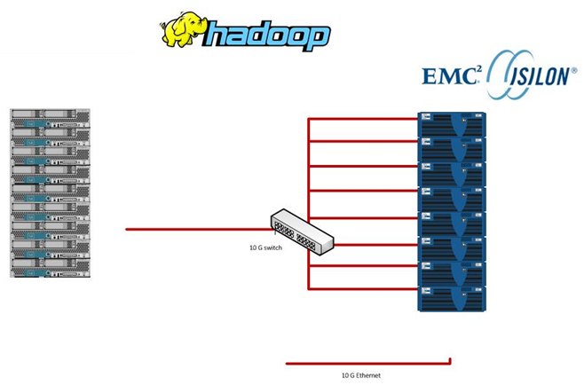
.. |image2| image:: deploying-cloudera-cdh-5-with-isilon_images/image002.png
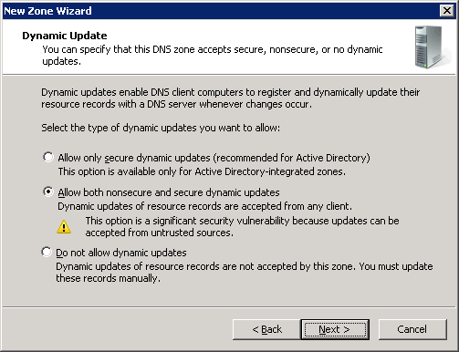
.. |image6| image:: deploying-cloudera-cdh-5-with-isilon_images/image004.png
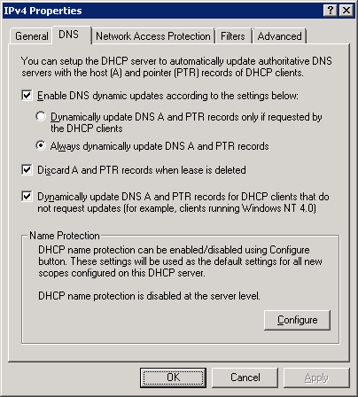
.. |image10| image:: deploying-cloudera-cdh-5-with-isilon_images/image006.png
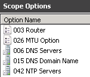
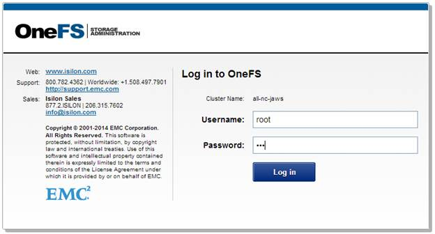
.. |image16| image:: deploying-cloudera-cdh-5-with-isilon_images/image009.png
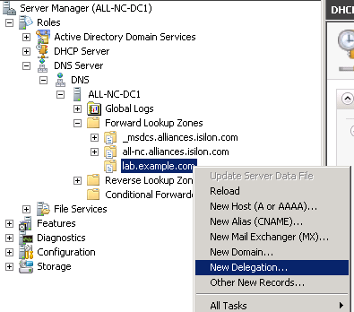
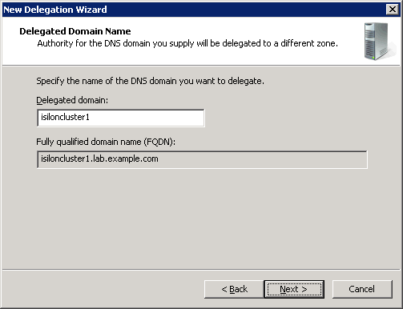
.. |image22| image:: deploying-cloudera-cdh-5-with-isilon_images/image012.png
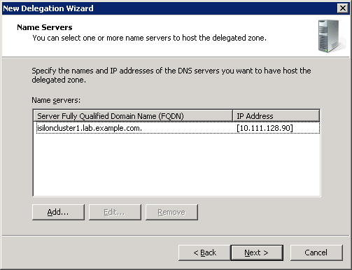
.. |image26| image:: deploying-cloudera-cdh-5-with-isilon_images/image014.png

.. |image30| image:: deploying-cloudera-cdh-5-with-isilon_images/image016.jpg
.. |image32| image:: deploying-cloudera-cdh-5-with-isilon_images/image017.jpg
.. |image34| image:: deploying-cloudera-cdh-5-with-isilon_images/image018.png
.. |image36| image:: deploying-cloudera-cdh-5-with-isilon_images/image019.jpg
.. |image38| image:: deploying-cloudera-cdh-5-with-isilon_images/image020.png
.. |image40| image:: deploying-cloudera-cdh-5-with-isilon_images/image021.jpg
.. |image42| image:: deploying-cloudera-cdh-5-with-isilon_images/image022.jpg
.. |image44| image:: deploying-cloudera-cdh-5-with-isilon_images/image023.jpg
.. |image46| image:: deploying-cloudera-cdh-5-with-isilon_images/image024.png
.. |image48| image:: deploying-cloudera-cdh-5-with-isilon_images/image025.png
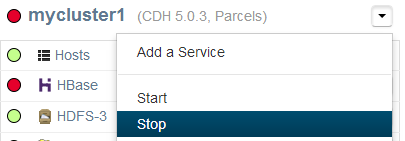
.. |image52| image:: deploying-cloudera-cdh-5-with-isilon_images/image027.jpg
.. |image54| image:: deploying-cloudera-cdh-5-with-isilon_images/image028.jpg
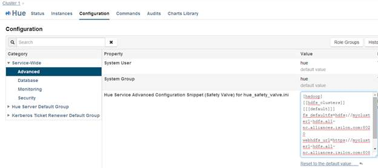
.. |image58| image:: deploying-cloudera-cdh-5-with-isilon_images/image030.png
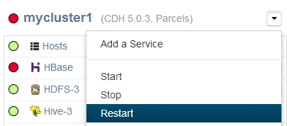
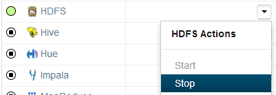
